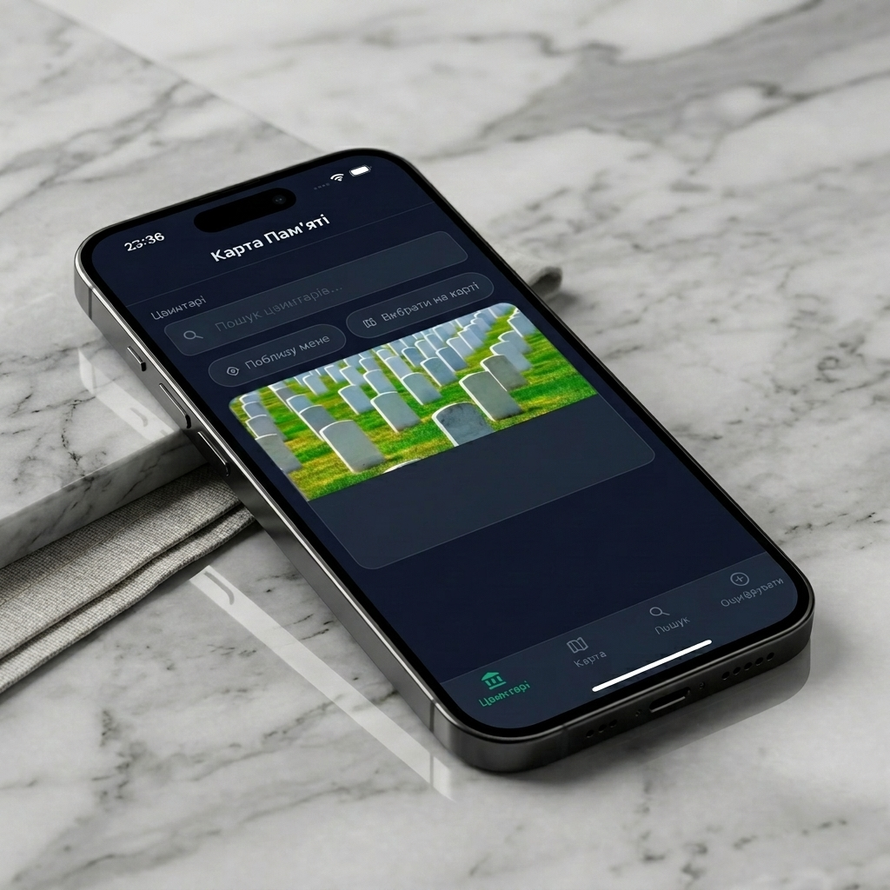
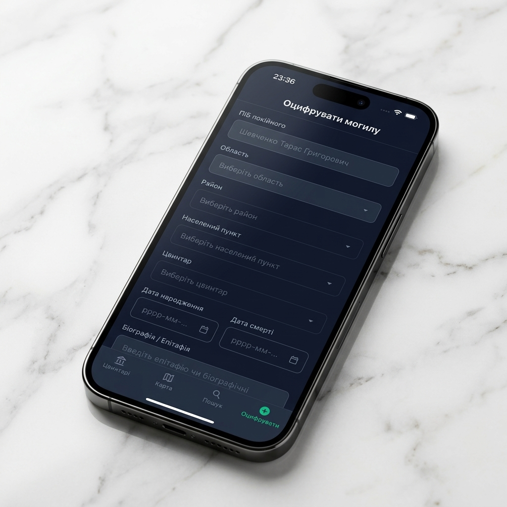

<p align="center">
    
    
</p>

<p align="center">
    <a href="https://github.com/DigitalHeritage-Lab/MemoryMap/actions/workflows/ci.yml">
        
    </a>
    <a href="https://github.com/DigitalHeritage-Lab/MemoryMap">
        
    </a>
    <a href="https://github.com/DigitalHeritage-Lab/MemoryMap/contributors">
        
    </a>
    <a href="https://github.com/DigitalHeritage-Lab/MemoryMap/issues">
        
    </a>
    <a href="LICENSE">
        
    </a>
    <a href="README.md">
        
    </a>
</p>

<p align="center">
  <a href="#-key-features">Features</a> •
  <a href="#%EF%B8%8F-tech-stack">Stack</a> •
  <a href="#-project-structure">Structure</a> •
  <a href="#-quick-start-for-developers">Quick Start</a> •
  <a href=".github/CONTRIBUTING.md">Contributing</a>
</p>

# 🏛️ MemoryMap — Digital Heritage Platform

**MemoryMap** is a cross-platform Flutter application for digitizing, cataloging, and interactive mapping of necropolises and burials in Ukraine. The project preserves cultural heritage through intuitive tools for collecting GPS data, biographical descriptions, and photo documentation directly "in the field."

---

## 🌟 Key Features

- 📍 **Interactive Necropolis Map** — OpenStreetMap with a CartoDB dark theme, distance filtering.
- 📱 **In-Field Digitization** — Step-by-step wizard with GPS, administrative selection (Region → District → Community), and photo capture.
- 🔍 **Smart Search** — Full-text search executed on the database side (Supabase RPC), eliminating the need for local filtering.
- ♾️ **Infinite Pagination** — Seamless scrolling utilizing `ScrollPaginationMixin` and Skeleton loading effects.
- 🇺🇦 **Full Localization** — Supported via ARB files and `context.l10n`.

---

## 🖼️ Preview

<table>
  <tr>
    <th>
      <a href="lib/components/cemeteries/widget/body/cemeteries_body.dart">Cemetery List</a>
      |
      <a href="lib/components/cemeteries/bloc/cemeteries_bloc.dart">BLoC</a>
    </th>
    <th>
      <a href="lib/components/digitize/widget/body/digitize_body.dart">Grave Digitization</a>
      |
      <a href="lib/components/digitize/bloc/digitize_bloc.dart">BLoC</a>
    </th>
  </tr>
  <tr>
    <th>
      <a href="lib/components/cemeteries/widget/body/cemeteries_body.dart">
        
      </a>
    </th>
    <th>
      <a href="lib/components/digitize/widget/body/digitize_body.dart">
        
      </a>
    </th>
  </tr>
</table>

---

## 🛠️ Tech Stack

| Layer | Technology |
|-----|-----------|
| **UI** | [Flutter 3.24+](https://flutter.dev) · `flutter_screenutil` |
| **State** | [flutter_bloc](https://bloclibrary.dev/) · `freezed` |
| **Navigation** | [go_router](https://pub.dev/packages/go_router) |
| **Backend** | [Supabase](https://supabase.com) (PostgreSQL + PostGIS, RPC only) |
| **Maps** | [flutter_map](https://pub.dev/packages/flutter_map) · `latlong2` |
| **DI** | [injectable](https://pub.dev/packages/injectable) · `get_it` |
| **Localization** | ARB · `flutter_localizations` · `intl` |
| **Linting** | [very_good_analysis](https://pub.dev/packages/very_good_analysis) |

---

## 📁 Project Structure

```
lib/
├── bootstrap.dart              # Service initialization and BlocObserver
├── main.dart                   # Entry point, MaterialApp + theme setup
├── components/                 # Feature modules (BLoC + View + Widget)
│   ├── cemeteries/             # Cemetery list, details, location filters
│   ├── digitize/               # Digitization form: GPS, admin dropdowns, dates
│   ├── graves/                 # Burial records list and viewing
│   ├── home/                   # Bottom Navigation Bar
│   └── map/                    # Interactive map with location markers
└── shared/                     # Shared UI, utilities, design system
    ├── extension/              # ErrorCodeExtension
    ├── mixin/                  # ScrollPaginationMixin
    └── theme/                  # AppColors, AppButton, AppScaffold
```


## 🚀 Quick Start for Developers

### Prerequisites
- [Flutter SDK](https://docs.flutter.dev/get-started/install) `>= 3.24.0`
- [Docker](https://www.docker.com/) (for running Supabase locally)

### Local Database (Supabase)

```bash
supabase start          # Starts PostgreSQL + Auth + Storage locally
```

### Code Generation

```bash
dart run build_runner build --delete-conflicting-outputs
```

### Run the App

```bash
flutter run
```

---

## 🧪 Quality Control

```bash
# Formatting
dart format .

# Analysis (must pass with zero warnings)
flutter analyze --fatal-warnings --fatal-infos

# Testing
flutter test --coverage
```

---

## 📄 License

Distributed under the [PolyForm Noncommercial 1.0.0 License](LICENSE).
